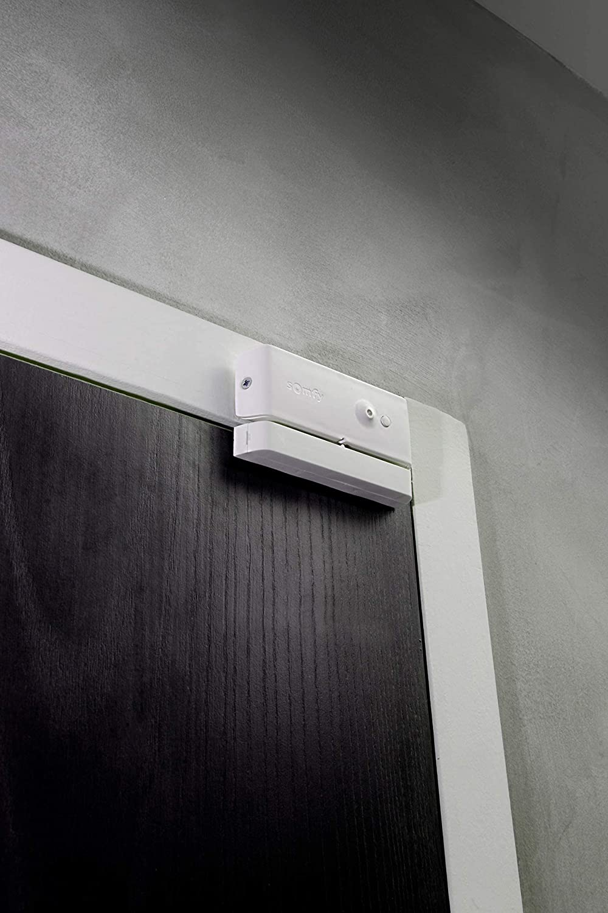
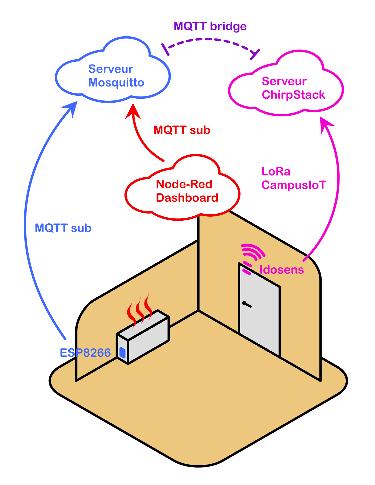
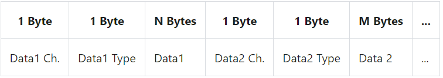

# Projet IoT : Détection d’ouverture de porte/fenêtre

Barbet Léo - Rivera Antoine

IESE5

## Sommaire

I_ Objectif

II_ Analyse du marché

III_ Architecture globale du système

IV_ Sécurité globale

V_ Respect de la vie privée du service

VI_ Architecture matérielle de l’objet

VII_ BOM du produit

VIII_ Certification ETSI

IX_ Implémentation du logiciel embarqué de l’objet

X_ Format des messages uplink

XI_ Métriques logiciel du logiciel embarqué

XII_ Durée de vie de la batterie

XIII_ Analyse du cycle de vie du produit

XIV_ Avantages et Inconvénients des produits concurrents

XV_ Intégrations effectuées

XVI_ Métriques du code développé

XVII_ Fonctionnalités prévues (réalisées et non réalisées)

XVIII_ Problèmes rencontrés

## 

## I_ Objectif

L’objectif de ce projet est de pouvoir détecter l’ouverture et la fermeture d’une porte. L’information de l’état de la porte sera transmise par LoRa et le réseau CampusIoT jusqu’à un serveur. Nous voulons également ajouter une interface graphique permettant à l’utilisateur de visualiser l’état de la porte. Enfin, nous utiliserons un ESP8266 pour simuler un contrôleur de radiateur qui nous permettrait par exemple d’allumer le chauffage uniquement quand la porte est fermée et de l’éteindre lorsqu’elle serait ouverte. Nous souhaitons dans ce projet utiliser un maximum de communication et d’outils différents pour découvrir leur implémentation : mqtt, LoRa, Wifi, Node-red, ChirpStack…

## II_ Analyse du marché

Le marché de la domotique est un marché très fourni avec beaucoup d’acteurs différents de la domotique qui proposent leur produit. La détection d’ouverture de porte et ou fenêtre a une place importante pour signaler les intrusions. Ces modules offrent souvent une option d’alarme et vont de pair avec la sécurité des bâtiments afin de lutter contre les cambriolages. Des solutions déjà existantes existent chez somfy, diagral, netatmo… Les prix vont de 30 à 50 euros environ par détecteur. Ces solutions s'intègrent la majorité du temps à des écosystèmes de la même marque.

Certains détecteurs optent pour la détection de vibration, pour des caméras ou des détecteurs magnétiques comme chez somfy par exemple. Dans ce cas là, les détecteurs magnétiques sont composés le plus souvent de deux pièces, un aimant fixé sur le côté ouvrant et un capteur sur le côté dormant. Pour les capteurs de vibration, l’avantage est qu’ils n’ont qu’une seule pièce sur le côté ouvrant et peuvent détecter l’ouverture et l’intrusion forcée (casse de la porte, fenêtre). Les figures II_1 et II_2 sont des exemples d’installations de deux détecteurs utilisant deux technologies différentes :

<table>
  <tr>
   <td>

Figure II_1 : Détecteur d’ouverture de porte par vibration
   </td>
   <td>

Figure II_2 : Détecteur d’ouverture de porte magnétique
   </td>
  </tr>
</table>

Les communications privilégiées pour ce type de matériel sont ZigBee, Wifi, Z Wave, BLE… 

## III_ Architecture globale du système

L’architecture globale du système utilisera une carte Idosens et une NodeMCU  ESP8266 comme objets connectés. La carte capteur Idosens est équipée d’un magnétomètre lsm303d qui nous permettra de mesurer le champ magnétique. Nous transmettrons ensuite via LoRa et le réseau de gateway CampusIoT une trame LoRaWAN contenant l’état de la porte jusqu’au serveur ChirpStack. C’est un serveur LoRa mis à notre disposition sur lequel nous pourrons voir les trames arriver. De plus, il publie les informations entrantes sur son serveur mqtt. Il nous permettra, via notre propre serveur mqtt MOSQUITTO tournant sur notre machine de récupérer l’état de la porte. Sur cette même machine, nous aurons un serveur node-red associé à un node-red-dashboard qui nous permettra de traiter l’information et de visualiser sur un interface graphique la porte, son état et l’état du radiateur. L’ESP8266 simule ici un contrôleur de radiateur qui sera connecté en Wifi au même réseau que la machine et pourra ensuite via le protocole MQTT récupérer les informations sur notre serveur MOSQUITTO. L’ESP8266 est un actionneur qui allumera le radiateur si la porte est fermée et l’éteindra si la porte est ouverte. L’architecture du système que nous souhaitons implémenter est détaillée sur la figure III_1 :

Figure III_1 : Illustration de l’architecture globale du système

## IV_ Sécurité globale

Les données que nous traitons ne sont pas très sensibles mais nous avons plusieurs sécurité au sein du projet. Commençons par le protocole LoRaWAN qui utilise deux couches de sécurité :

<table>
  <tr>
   <td>Une première permet de sécuriser sa couche réseau, LoRaWAN, afin de garantir l’authenticité de l’objet sur le réseau. Ainsi, un autre objet sur le réseau ne peut pas usurper l’identité de notre objet.

La seconde couche de chiffrement est réalisée sur la partie Application. Elle assure que l’opérateur du réseau n’a pas accès aux données de l’application de l’utilisateur. En effet, le contenu du Payload encapsulé dans la trame est protégé et ne peut pas être lu par les passerelles.
   </td>
   <td>

Figure IV_1 : Sécurité de LoRaWAN
   </td>
  </tr>
</table>

De plus, nous utiliserons la méthode OTAA qui nécessite un passage par un join, une demande d’acceptation au réseau. Un DevEUI de 64 bits, un AppEUI de 64 bits et une AppKey de 128 bits sont fournis pour chaque appareil mobile et constituent leur identité.

LoRaWAN utilise l’algorithme de chiffrement symétrique AES qui permet l’échange de clés et offre la confidentialité et l’intégrité des données dans la transmission.

Le serveur ChirpStack côté MQTT utilise également une sécurité avec un couple identifiant/mot de passe secret ainsi qu’un certificat SSL qui sécurise les transmissions MQTT. Enfin, nous avons sécurisé notre serveur Node-red avec un couple identifiant/mot de passe secret. De plus, il n’est pas accessible de l'extérieur mais seulement en local sur la machine du serveur.

Ces précautions nous permettent d’assurer de bout en bout une sécurité, une confidentialité et une intégrité des données.

## V_ Respect de la vie privée du service

Le CNIL (Commission nationale de l'informatique et des libertés) est l'autorité française chargée de la protection des données personnelles et de la vie privée. Le RGPD (Règlement général sur la protection des données) est une réglementation européenne qui a pour objectif de renforcer les droits et les libertés des personnes en matière de protection de leurs données personnelles.

Les risques d’atteintes au respect de la vie privée sont :

* La collecte, l'utilisation ou la divulgation non autorisée de données personnelles
* La surveillance non autorisée de la vie privée des individus
* L'utilisation de données personnelles à des fins illégales ou malveillantes

## VI_ Architecture matérielle de l’objet

Nous avons ici deux objets, une carte capteur Idosens et une NodeMCU ESP8266. L’architecture matérielle de la carte Idosens est basée sur un microcontrôleur STM32L151. Il communique via deux bus SPI différents au module Radio LoRa SX1276 et au capteur Magnétomètre/Accéléromètre lsm303d. Un capteur de température AT30TS74 et un capteur de lumière ambiante TSL25711 sont également présents sur la carte et communiquent avec le STM32 par un bus I2C. L’alimentation est régulée par un circuit Boost DC/DC basé sur un régulateur de tension à découpage MAX1722EZK. L’architecture est décrite à la figure VI_1 :

Figure VI_1 : Architecture de la carte capteur Idosens

La NodeMCU ESP8266 est basée sur un microcontrôleur ESP8266 de Espressif Systems. Ce microcontrôleur inclut déjà toute la connectivité nécessaire : récepteur/transmetteur Wifi. L’alimentation peut venir d’une broche ou du port micro USB et est régulée à 3.3V par un module AMS1117.

## VII_ BOM du produit

La BOM du produit pour 5000 unité est la suivant :

<table>
  <tr>
   <td colspan="2" >Idosens (5000 unités)
   </td>
  </tr>
  <tr>
   <td>PCB (jlb pcb)
   </td>
   <td>2 142,56€
   </td>
  </tr>
  <tr>
   <td>Estimation des composants (rs)
   </td>
   <td>104 749 €
   </td>
  </tr>
  <tr>
   <td>Boitier (entrepot du bricolage)
   </td>
   <td>12 500 €
   </td>
  </tr>
  <tr>
   <td colspan="2" >ESP8266 (5000 unités)
   </td>
  </tr>
  <tr>
   <td>NodeMCU ESP8266 (rs)
   </td>
   <td>43 650€
   </td>
  </tr>
  <tr>
   <td>TOTAL
   </td>
   <td>163 000 €
   </td>
  </tr>
</table>

## VIII_ Certification ETSI

D'après le site de la lora-alliance, on peut estimer que le coût de la certification ETSI du produit est de l’ordre de 900 €.

## IX_ Implémentation du logiciel embarqué de l’objet

Le code du logiciel embarqué de l’objet est disponible dans le répertoire ./endpoint/src/.

## X_ Format des messages uplink

Dans le cadre des échanges LoRaWAN, nous utilisons le format LPP. Il est défini selon la figure X_1 suivante :

Figure X_1 : Format de Cayenne Low Power Payload

Nous transmettons dans le payload, la température et les mesures du champ magnétique. Pour la température, nous utilisons le type “Temperature Sensor” et pour le champ magnétique, nous utilisons “Accelerometer” afin de pouvoir transmettre les 3 valeurs correspondantes les 3 axes.

Le format du payload d’une trame est donc le suivant :

<table>
  <tr>
   <td>01
   </td>
   <td>67
   </td>
   <td>T[15:8]
   </td>
   <td>T[7:0]
   </td>
   <td>02
   </td>
   <td>71
   </td>
   <td>Mx3[15:8]
   </td>
   <td>Mx3[7:0]
   </td>
   <td>Mx2[15:8]
   </td>
   <td>Mx2[7:0]
   </td>
   <td>Mx1[15:8]
   </td>
   <td>Mx1[7:0]
   </td>
  </tr>
</table>

Figure X_2 : Format du payload selon LPP

## XI_ Métriques logiciel du logiciel embarqué

Nous avons donc différents codes pour la carte NodeMCU ESP8266, pour la carte capteur Idosens et pour le serveur Node-Red. Les métriques de chaque logiciel sont résumées dans le tableau suivant :

<table>
  <tr>
   <td>
   </td>
   <td>nombre de lignes de code
   </td>
   <td>taille du binaire du firmware
   </td>
  </tr>
  <tr>
   <td>NodeMCU ESP8266
   </td>
   <td>152
   </td>
   <td>279 Ko
   </td>
  </tr>
  <tr>
   <td>carte capteur Idosens
   </td>
   <td>753
   </td>
   <td>55.1 Ko
   </td>
  </tr>
  <tr>
   <td>Node-Red
   </td>
   <td>212
   </td>
   <td>8,4 Ko
   </td>
  </tr>
  <tr>
   <td>TOTAL
   </td>
   <td>1107
   </td>
   <td>342,5 Ko
   </td>
  </tr>
</table>

## XII_ Durée de vie de la batterie

Nous ne pouvons pas définir une durée de vie des batteries puisqu’elle dépend du comportement de l’utilisateur. Initialement, nous souhaitions mettre la carte en veille et la réveiller par interruption déclenchée par le capteur. Lorsque la porte serait ouverte, un front montant serait observé réveillant ainsi la carte principale. Malheureusement, le temps du projet étant restreint, nous n’avons pas pu nous procurer un tel capteur magnétique. Dans ces conditions, en imaginant que la porte serait ouverte et fermée une fois par heure, nous aurions une durée de vie des batteries estimée à 2 ans. Pour ce calcul, nous avons utilisé le site [https://www.elsys.se/en/battery-life-calculator/](https://www.elsys.se/en/battery-life-calculator/) et nous avons pris pour modèle, les piles Duracell AA de 3000 mAh.

## XIII_ Analyse du cycle de vie du produit

L'analyse du cycle de vie (ACV) est une méthode d'évaluation normalisée permettant de réaliser un bilan environnemental de son cycle de vie. Le cycle de la vie du produit comprend les étapes suivantes :

* Conception: Le développement et la conception du produit, y compris la définition des spécifications techniques et des fonctionnalités.
* Production: La fabrication et l'assemblage des composants pour créer le produit final.

*Les émissions carbones liées à la production matérielle représente 50% de l'empreinte carbone du produit sur son cycle de vie complet.
Ces émissions carbone peuvent être amorties en optimisant et allongeant le temps d'utilisation.*

* Distribution: La vente et la livraison du produit aux clients.
* Utilisation: L'utilisation du produit par les clients pour détecter les mouvements de la porte. Cette étape inclut la gestion des données collectées et la sécurité des données.

*Les data centers en eux même compte pour 1% de la demande énergétique. Ils eclipsent plus que la consommation. D'ici 2030, les prédictions montrent que les datacenters représentront 7% de la demande énergétique mondiale.*

*La gestion des données collectées et la sécurité des données sera la partie avec le plus gros impact sur l'environnement.*

* Entretien: La maintenance et les mises à jour du produit pour assurer son bon fonctionnement.
* Fin de vie: La fin de la vie utile du produit et son élimination ou recyclage.

*Le cuivre représente environ 7 % (en masse) des déchets d'équipements électriques et électroniques.*
*Le cuivre est un matériau 100 % recyclable sans aucune altération ni perte de performance. Le recyclage de matières cuivreuses consomme moins d'énergie que la fabrication de cuivre à partir de minerai.*

Les chiffres sont tirés d’une étude de la Harvard University sur l’empreinte carbone de la microélectronique. 

## XIV_ Avantages et Inconvénients des produits concurrents

Parmis les capteurs de détection d’ouverture de portes, il existe donc des capteurs à vibration. Ils sont plus fiables que ceux à détection magnétique puisqu’ils ne peuvent pas être trompés par un tiers. Un capteur magnétique peut être faussé avec un aimant. Ils offrent également l’avantage de détecter le forçage d’une porte ou d’une fenêtre. Si une personne tente une intrusion en cassant la vitre, les vibrations déclencheront le capteur.

La connectivité des concurrents est à double tranchant. Elle offre de meilleure performance avec un environnement optimisé mais doivent souvent être intégré à des environnement propriétaire. Ainsi, un capteur à détection d’ouverture ne fonctionnera que si vous possédez aussi la borne de la même marque, la caméra de la même marque. L’avantage est que les performances sont optimisées puisque le constructeur à la main sur toutes les interactions et tous les éléments de la chaîne. L'inconvénient est que l’utilisateur doit s’enfermer dans la solution d’un seul constructeur. D’autres concurrents sont plus souples et vendent des solutions à intégrer à Google Home, Jeedom…

Enfin, l’avantage certain des concurrents est sur la durée de vie des batteries et de l’objet. Le temps de développement de leur produit étant à leur avantage, ils ont pu travailler longuement à l’optimisation du cycle d’utilisation.

## XV_ Intégrations effectuées

Nous avons utilisé Node-red dashboard pour l’intégration du projet afin d’illustrer l’état de la porte. Nous souhaitions avoir un affichage personnalisé ou on comprenait au premier coup d'œil, l’état et la configuration du système. Deux LEDs permettent d’informer l’utilisateur de l’état de la porte (une LED) et de l’état du radiateur (une LED). De plus, un schéma animé de la pièce est représenté sur le dashboard. La porte sur le schéma montre si elle est fermée ou ouverte :

<table>
  <tr>
   <td>

Figure XV_1 : Illustration du dashboard avec la porte fermée
   </td>
   <td>

Figure XV_2 : Illustration du dashboard avec la porte ouverte
   </td>
  </tr>
</table>

Nous avons utilisé Node-red et Node-red dashboard puisque cette solution est facile à prendre en main et nous ne l’avions encore jamais utilisé. De plus, elle permet la création de widgets personnalisés avec les nodes templates et du code HTML/CSS associé au code Angular. Nous souhaitions vraiment opter pour une solution permettant de créer une carte illustrant l’étage d’un bâtiment et animer toutes les portes en temps réel. Ici, la carte est simplifiée à une pièce mais peut être facilement étendue.

Node-red est également une solution offrant la connexion MQTT ce qui correspondait à nos besoins dans l’optique d’un échange avec notre serveur MQTT mosquitto. Le dashboard complet est le suivant :

Figure XIV_3 : Illustration du code Node-Red

## XVI_ Métriques du code développé

Les codes utilisés pour l’objet, l’application et l’intégration ont, en partie, repris des travaux déjà existants. Ici, nous nous concentrons sur les lignes de code que nous avons rédigées. Pour chaque support sur lequel nous avons développé, nous ajoutons également le langage de programmation.

<table>
  <tr>
   <td>
   </td>
   <td>nombre de lignes de code
   </td>
   <td>Langage de programmation
   </td>
  </tr>
  <tr>
   <td>NodeMCU ESP8266
   </td>
   <td>40
   </td>
   <td>C++, Arduino
   </td>
  </tr>
  <tr>
   <td>carte capteur Idosens
   </td>
   <td>334
   </td>
   <td>C
   </td>
  </tr>
  <tr>
   <td>Node-Red
   </td>
   <td>110
   </td>
   <td>HTML/CSS, Angular
   </td>
  </tr>
  <tr>
   <td>TOTAL
   </td>
   <td>484
   </td>
   <td>
   </td>
  </tr>
</table>

## XVII_ Fonctionnalités prévues (réalisées et non réalisées)

Les fonctionnalités prévues sont toutes listées ci dessous. Les fonctionnalités réalisées sont précédées d’un plus (+), les fonctionnalités non réalisées sont précédées d’un moins (-) :

+Mesure du champ magnétique via le magnétomètre présent sur la carte capteur Idosens

+Mesure de la température via le capteur de température présent sur la carte capteur Idosens

-Mise en veille prolongée de la carte capteur Idosens et réveil via interruption du capteur

-Emission des mesures de champ magnétiques et de température via LoRa en utilisant le protocole LoRaWAN

&nbsp;&nbsp;&nbsp;&nbsp;&nbsp;&nbsp;*+LoRa ne fonctionnant pas avec la carte capteur Idosens, nous avons émis des trames LoRaWAN avec la carte télécommande Idosens sans les mesures puisque les capteurs n’existent pas sur cette carte.*

+Réception des trames LoRaWAN sur ChirpStack

-Décodage des trames LoRaWAN utilisant le format Cayenne LPP

-Lien MQTT entre le serveur ChirpStack et notre serveur MQTT MOSQUITTO

+Lien MQTT entre le serveur MOSQUITTO et l’interface Node-red

+Lien MQTT entre le serveur MOSQUITTO et la NodeMCU ESP8266

+Création d’une interface graphique avec une pièce d’un appartement dont la porte est animée

-Création d’une interface graphique avec un appartement dont les portes sont animées

+Allumage / Extinction du radiateur en fonction des données de l’état de la porte publiées sur MQTT

Le schéma final de fonctionnement avec les liens manquants en gris :

Figure XVII_1 : Schéma de fonctionnement illustrant les liens manquant en gris

## XVIII_ Problèmes rencontrés

Nous avions pour consigne initialement d’utiliser la carte capteur Idosens. Elle embarque les composants permettant d’utiliser la communication LoRa et dispose notamment d’un capteur magnétique et de température. Cette carte est à l’origine de la majorité des fonctionnalités non réalisées. Nous devions également utiliser RIOT qui est un environnement de développement se voulant facile d’utilisation grâce un niveau d’abstraction très élevé. Un niveau d’abstraction très élevé est nécessaire pour pouvoir créer un objet connecté dans des délais réduits comme le demandait le projet. En revanche, cela présente un désavantage certain quand les fonctionnalités de base ne fonctionnent pas. Nous n’avons jamais réussi à utiliser la communication LoRa sur la carte capteur Idosens. La documentation de RIOT est relativement restreinte et propose peu d’exemple lorsque l’on sort d’une utilisation classique. Le capteur magnétomètre n’était pas inclus ni dans la board Idosens, ni dans les dossiers de RIOT OS. Nous avons donc dû développer son driver et ajouter sa configuration à RIOT.

Un second problème rencontré concernait la communication entre ChirpStack et notre serveur MQTT MOSQUITTO. Pour des raisons de temps, nous n’avons pas réussi à terminer la liaison, le bridge entre les deux serveurs MQTT. Cela nous aurait permis de rediriger les données de l’objet dans l’application ChirpStack jusqu’à notre serveur MQTT. Notre filière n’abordant pas cette partie du système, nous avons découvert tout ce fonctionnement et nous n’avons pas eu le temps de mettre en œuvre ces intéractions.
